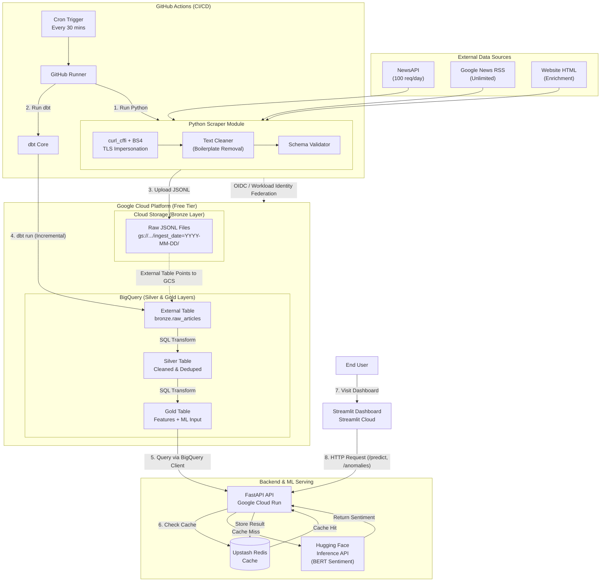

# Real-Time News Intelligence Platform

An automated pipeline that scrapes financial news, processes it through a data lake + warehouse, analyzes sentiment via a fine-tuned BERT model, and serves insights via an interactive dashboard.

## Architecture Overview



## Data Flow (High-Level)

1. **Scrape & Enrich** → GitHub Actions (cron every 2 hours) runs the Python scraper to fetch news from **NewsAPI** and **Google News RSS feeds**. Using `curl_cffi` and `BeautifulSoup`, it visits article URLs to extract the **full HTML body text** (enrichment), augmenting raw metadata with long-form content.
2. **Land (Bronze)** → Raw JSONL is stored in **Google Cloud Storage** as the Bronze layer, partitioned by date.
3. **Transform (ELT)** → **dbt** runs SQL in **BigQuery** to:
   - Clean and deduplicate raw data (Silver layer).
   - Aggregate and extract features (Gold layer: company entities, word counts, and a concatenated `model_input_text`).
4. **Serve** → **FastAPI** backend on **Google Cloud Run** exposes endpoints:
   - `GET /predict?company=X&days=Y` → Returns sentiment trend and average score.
   - `GET /anomalies` → Returns articles with unusual sentiment shifts.
5. **Cache** → **Upstash Redis** (cloud-hosted Redis) caches model predictions for **6 hours** to reduce API calls.
6. **Visualize** → **Streamlit** dashboard queries FastAPI and BigQuery to display KPI tiles, time-series charts, and entity word clouds.

## Technology Stack

| Layer | Tool | Hosting |
| :--- | :--- | :--- |
| Orchestration | GitHub Actions (cron schedule) | GitHub (free) |
| Data Extraction (APIs) | `curl_cffi`, `feedparser`, `beautifulsoup4` | GitHub Runner |
| Data Lake (Bronze) | Google Cloud Storage (GCS) | GCP Free Tier (5 GB) |
| Data Warehouse (Silver/Gold) | Google BigQuery | GCP Free Tier (10 GB + 1 TB queries/mo) |
| Transformations | dbt Core | Runs locally, executes in BigQuery |
| Backend API | FastAPI | Google Cloud Run (2M requests/mo free) |
| Model Serving | Hugging Face Inference API | Hugging Face (free tier) |
| Cache | Upstash Redis | Upstash Free Tier (10k commands/day) |
| Dashboard | Streamlit | Streamlit Cloud (free) |
| Containerization | Docker | Local build, deployed to Cloud Run |

## Project Structure

```
news-platform/
├── src/
│   ├── scraper/                # News scraping + enrichment service
│   │   ├── main.py                 # Orchestrator: runs scrapers, validates, uploads to GCS
│   │   ├── config.py               # Configuration via environment variables
│   │   ├── newsapi_scraper.py      # Scrape from NewsAPI
│   │   ├── google_news_scraper.py  # Scrape from Google News RSS
│   │   └── enrichment.py           # BeautifulSoup HTML body extraction
│   │
│   ├── api/                    # FastAPI backend (refactored from src/api/)
│   │   ├── main.py                 # REST endpoints: /predict, /anomalies, /health
│   │   ├── config.py               # Environment variable management
│   │   ├── database.py             # BigQuery connection & query helpers
│   │   ├── cache.py                # Upstash Redis client
│   │   ├── hf_client.py            # Hugging Face inference client
│   │   └── schemas.py              # Pydantic request/response models
│   │
│   └── dashboard/              # Streamlit frontend
│       ├── app.py                  # Interactive dashboard with charts & KPIs
│       └── config.py               # Environment variable management
│
├── dbt/                        # Data transformation pipeline
│   ├── models/
│   │   ├── staging/                # stg_raw_articles (view)
│   │   ├── silver/                 # silver_cleaned_articles (merge)
│   │   └── gold/                   # gold_article_features (insert_overwrite)
│   ├── tests/                      # dbt generic tests (not_null, unique, accepted_values)
│   ├── dbt_project.yml             # Project config + materialization settings
│   └── profiles.yml                # BigQuery connection profile
│
├── .github/workflows/          # GitHub Actions CI/CD
│   └── scrape.yml                  # Cron job: scrape → dbt transform
│
├── docs/                       # Architecture documentation
│   ├── 00_ARCHITECTURE_OVERVIEW.md
│   ├── 01_RAW_JSON_SCHEMA.md
│   ├── 03_DBT_TRANSFORMATIONS.md
│   ├── 04_FASTAPI_SPEC.md
│   └── 05_DASHBOARD_WIREFRAME.md
│
├── requirements.txt            # Dashboard dependencies for Streamlit Cloud
├── requirements-api.txt        # Scraper dependencies for Github Actions
├── requirements-scraper.txt    # Backend API dependencies for Docker
├── requirements-dev.txt        # Python dependencies for local development
├── .env.example                # Required environment variables
└── .env                        # Local environment overrides
```

## Endpoints

### `GET /predict?company=X&days=Y`

Returns sentiment trend and average score for a specific company over a given number of days.

**Parameters:**

| Parameter | Type | Required | Default | Description |
| :--- | :--- | :--- | :--- | :--- |
| `company` | String | Yes | N/A | Company name (case-insensitive). Must match `company_entity` in Gold table. |
| `days` | Integer | No | 7 | Number of past days to analyze (max 90). |

**Example:** `GET /predict?company=Tesla&days=30`

**Cache:** Upstash Redis with key `predict:{company}:{days}`, TTL 6 hours.

### `GET /anomalies?days=N&threshold=T`

Returns articles with extreme sentiment shifts. Useful for breaking news alerts.

**Parameters:**

| Parameter | Type | Required | Default | Description |
| :--- | :--- | :--- | :--- | :--- |
| `days` | Integer | No | 1 | Lookback window in days. |
| `threshold` | Float | No | 0.5 | Sentiment change threshold. |

**Cache:** Upstash Redis with key `anomalies:{days}:{threshold}`, TTL 6 hours.

### `GET /health`

Simple health check for Cloud Run monitoring. Returns BQ, Redis, and HuggingFace connectivity status.

## Quick Start (Local Development)

```bash
# 1. Clone the repository
git clone https://github.com/dung0-o/news-platform.git
cd news-platform

# 2. Copy environment file
cp .env.example .env
# Edit .env and fill in your API keys

# 3. Install dependencies
pip install -r requirements-dev.txt

# 4. Run the scraper (one-time)
python src/scraper/main.py

# 5. Run dbt models
cd dbt
dbt run --profiles-dir . --profile news_platform

# 6. Start the FastAPI server
cd ../src/api
uvicorn main:app --reload --port 8000

# 7. Open the Streamlit dashboard
# In another terminal:
cd ../src/dashboard
streamlit run app.py
```

## Deployment (Google Cloud Run)

```bash
# Build the API container
docker build -t gcr.io/<project-id>/news-api:latest .

# Deploy
gcloud run deploy news-api \
  --image gcr.io/<project-id>/news-api:latest \
  --region us-central1 \
  --platform managed \
  --timeout 300s \
  --set-env-vars "GCP_PROJECT_ID=..." \
  --set-env-vars "BIGQUERY_DATASET=..." \
  --set-env-vars "GOOGLE_APPLICATION_CREDENTIALS=..." \
  --set-env-vars "UPSTASH_REDIS_URL=..." \
  --set-env-vars "HUGGINGFACE_API_KEY=..." \
  --set-env-vars "HUGGINGFACE_MODEL_ID=..."
```

## Deployment Goal

The final output is a **public-facing, interactive web application** that allows users to:

- Search for any company and view its 30-day sentiment trend.
- Detect breaking news spikes and anomalous sentiment drops.
- Export filtered data as CSV for deeper analysis.
